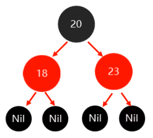
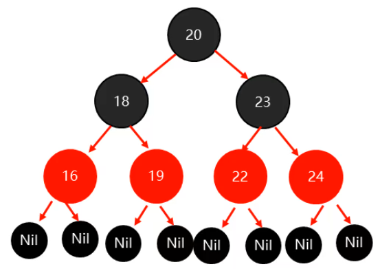

## 红黑树特点

- 是平衡二叉树
- 每一个节点可以是红或者黑
- 红黑树不是高度平衡的，它的平衡是通过"自己的红黑规则"进行实现的

## 红黑规则

1. ==每一个节点是红色或黑色==

2. ==根节点必须是黑色==

3. ==每个叶节点(Nil)是黑色的==

   > 如果一个节点没有子节点或者父节点，则该节点相应的指针属性值为Nil，这些Nil视为叶节点

4. ==不能出现两个红色节点相连的情况==

5. ==对每一个节点,从该节点到其所有后代叶节点的简单路径上，均包含相同数目的黑色节点==

## 添加节点的默认颜色

* 添加三个黑色节点时

  * 第一次添加不需要调整
  * 第二次，第三次添加会破坏第五条红黑规则，需要由黑色调整为红色
  * 共需调整三次

  

- 添加三个红色节点时

  - 第一次添加破坏第二条红黑规则，需要由红色调整为黑色
  - 第二次，第三次添加不需要调整
  - 共需调整一次

  

- 综上，==添加红色节点时，效率更高，因此默认为红色==

## 添加节点时如何保持红黑规则

1. 以(20)、(18)、(23)、(22)、(16)、(24)、(19)、(15)、(14)的顺序添加节点举例说明

2. 第一次添加

   * 当添加的节点为==根节点==时，==直接调整为黑色==

   

3. 第二次，第三次添加

   * 当添加的节点，其==父节点是黑色==，则==不需要做任何操作==

   

4. 第四次添加

   * 当添加的节点，其==父节点是红色==，==叔节点也是红色==
     * 将父节点和叔节点都调整为黑色
     * 将祖父节点调整为红色
     * 如果祖父节点是根节点，则将根节点再次调整为黑色

   

5. 第五六七次添加

   * 当添加的节点，其父节点是黑色，则不需要做任何操作

   

6. 第八次添加

   * 当添加的节点，其==父节点是红色==，==叔节点也是红色==
     - 将父节点和叔节点都调整为黑色
     - 将祖父节点调整为红色
     - 如果祖父节点是根节点，则将根节点再次调整为黑色

   

7. 第九次添加

   * 当添加的节点，其==父节点是红色==，==叔节点是黑色==
     * 将父节点调整为黑色，叔节点不做操作
     * 将祖父节点设为红色
     * 以祖父节点为支点进行旋转

   

- 添加节点时保持红黑规则的方法总结

         